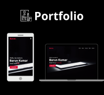

<h1 align="center">MY PORTFOLIO</h1>

  

### Overview

My Portfolio Website is a modern, responsive, and elegantly crafted platform that serves as a representation of your professional profile. Utilizing a range of front-end technologies, this website provides visitors with an immersive experience to explore your skills, services, and contact information.

### Features

- **Responsive Design:** The website is built with HTML, CSS, and JavaScript, ensuring a responsive layout that adapts seamlessly to various devices and screen sizes.
- **Navigation:** A smooth and intuitive navigation system allows users to effortlessly move between sections of the website using the menu, enhancing the overall user experience.
- **Content Sections:** The site is divided into multiple sections, including Home, About, Services, Skills, and Contact. Each section provides detailed insights into different aspects of your expertise.
- **Interactive Elements:** Engaging elements like the typing animation and Owl Carousel script add interactivity, making the website visually appealing and captivating.

### Sections

- **Home:** A welcoming introduction with your name and a dynamic typing animation showcasing your role as a Full Stack Developer. A call-to-action button invites users to connect via LinkedIn.
- **About:** Presents a comprehensive overview of yourself, including an image, a brief description, and a downloadable CV for users to explore your background further.
- **Services:** Highlights the services you offer, using icons and descriptive text to communicate your expertise in web design, advertising, and app design.
- **Skills:** Demonstrates your proficiency in HTML, CSS, and JavaScript through visually represented bars, providing a snapshot of your skill levels.
- **Contact:** Offers multiple ways for visitors to get in touch, including your name, address, email, and a contact form for direct messages.

### Tech Stack

- **Front-end:** HTML, CSS, JavaScript
- **Libraries/Plugins:** Font Awesome, Typed.js, Owl Carousel, Waypoints
- **Frameworks:** jQuery for interactivity and responsiveness
